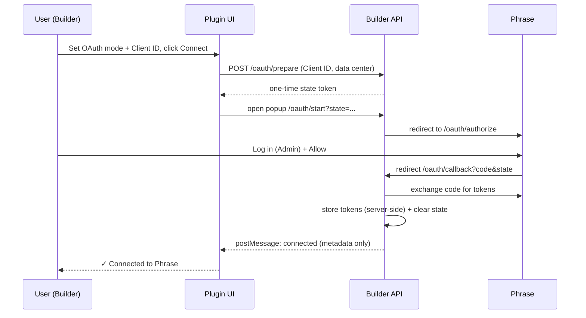

# Builder.io Phrase Integration Plugin

## Installation

From the plugins tab, pick `Phrase`, it'll ask you for your phrase user name and password, make sure the user has a `Project Manager` role.


## Authentication

The plugin supports two authentication modes, selected via the **Authentication** dropdown in the plugin settings:

- **Username / password** (default) — the classic flow. Enter the Phrase username and password of a user with a `Project Manager` role.
- **SSO / OAuth 2.0** — recommended for organizations that enforce SSO (where username/password login is blocked). Each organization registers its own Phrase OAuth app and connects via a login popup; no password is stored.

Both modes are fully supported. You can switch between them at any time, and switching does not delete the other mode's stored credentials.

### Switching to OAuth (SSO)

#### Prerequisites

- A Phrase TMS user with an **Administrator** profile (required both to register the OAuth app and to approve the connection).
- Your Phrase **data center**: US (`us.cloud.memsource.com`) or EU/default (`cloud.memsource.com`).

#### Part A — Register an OAuth app in Phrase

1. Sign in to Phrase TMS as an **Administrator**.
2. Go to **Settings → Integrations → Registered OAuth Apps**.
3. Create a new OAuth app.
4. Set the **Redirect URI** exactly to:
   ```
   https://cdn.builder.io/api/v1/memsource/oauth/callback
   ```
   If Builder gave you a custom API host, use that host with the same `/api/v1/memsource/oauth/callback` path.
5. Save the app and copy the **Client ID**. Phrase does not issue a client secret — that's expected; only the Client ID is needed.

#### Part B — Connect the Builder plugin

1. In Builder, open **Space Settings → Integrations → Phrase**.
2. Set **Authentication** to **SSO / OAuth 2.0**.
3. If your Phrase account is on the **US** data center, enable **"Account's data center is US based."**
4. Paste the **Client ID** from Part A into **OAuth Client ID**.
5. Click **Connect to Phrase**.
6. In the popup, log in with an **Administrator** profile and click **Allow**.
7. Confirm the panel shows **✓ Connected to Phrase**, then **Save** the settings.

#### How the connection works



The access token is stored and used only on the Builder server; the browser only ever receives connection metadata.

#### Verify

Run a **Translate** action on any entry — it should create the Phrase project/job as usual.

#### Good to know

- Each organization registers its **own** OAuth app; the Client ID is per-org and entered in plugin settings (there is no shared, Builder-wide client).
- Phrase access tokens are short-lived (~1h) and Phrase often issues no refresh token. If a translation action reports **"Phrase OAuth session expired. Please reconnect,"** click **Connect to Phrase** again. This is uncommon day-to-day but is the expected reconnect path.
- To revert, switch **Authentication** back to **Username / password** — the previously entered credentials are still stored.
- Use **Disconnect from Phrase** in the connection panel to revoke the stored OAuth token.

## Translating content
What's being translated:
- All text elements in builder content [you can exclude specific element by right click + `exclude from future translations`]
- All custom fields in content that are marked as `localized`
- All custom components inputs that are marked as `localized`


How To translate?
- once done with preparing content, publish it, and press the triple dots options menu on the top right of the editor:


Then click Translate


- it'll ask you for the source language and target languages and create a project in phrase with those configuration.

- once the project is completed, press on `Apply Translation` to get the translated values into your content.
- You can at any time restart the process by pressing on `Reset Translation`.

Future work:
- Automating the translation application on content once a project is completed in phrase.
